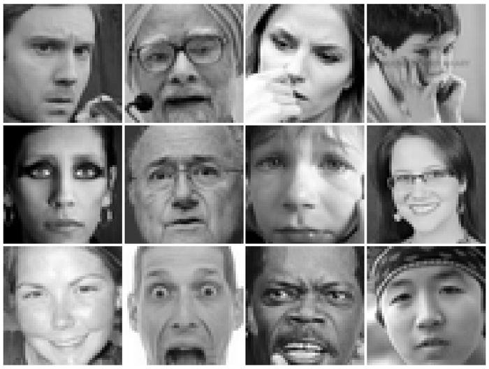

# Facial Expression Emotion Detector. 

This is the Quarter 1 Project for the course DSC 180A. In this project, we collected and created multiple baseline models for predicting emotions purely based off facial expression. 

Download the dataset from [here](https://paperswithcode.com/dataset/fer2013)